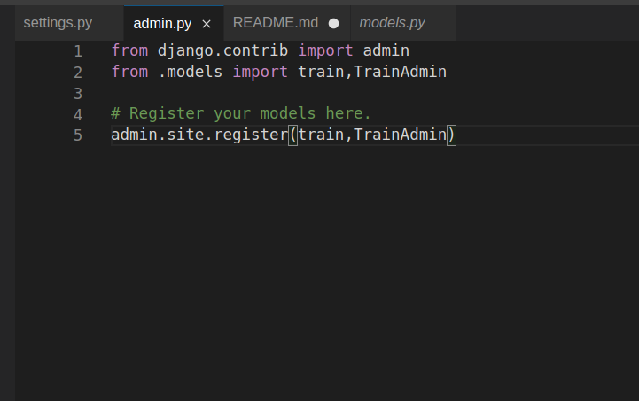

# Django ORM Web Application

## AIM
To develop a Django application to store and retrieve data from a database using Object Relational Mapping(ORM).

## Entity Relationship Diagram


## DESIGN STEPS

### STEP 1:
TO CREATE A ORM-APP USING OUR OWN WEBSERVER

### STEP 2:
EXCECUTE THE COMMANDS CORRECTLY IN THE TERMINAL AND MAKE SOME CHANGES IN THE MODELS.PY AND ADMIN.PY AND RUN THE SERVER

### STEP 3:
OPEN THE DJANGO SERVER AND THE APP IS READY TO EXCEUTE OUR INFORMATIONS


## PROGRAM
```
from django.db import models
from django.contrib import admin
# Create your models here.
class train(models.Model):
    trainnumber = models.IntegerField(max_length=10, help_text="Your Train Number")
    name =models.CharField(max_length=100)
    age = models.IntegerField() 
    email = models.EmailField()
    destination = models.CharField(max_length=100)
    stationname = models.CharField(max_length=100)
    destination = models.CharField(max_length=100)
    classtype = models.CharField(max_length=128)
    depaturedate = models.DateField()
class TrainAdmin(admin.ModelAdmin):
    list_display = ('trainnumber','name','age','email','stationname','destination','classtype','depaturedate')    
```

## OUTPUT




## RESULT
